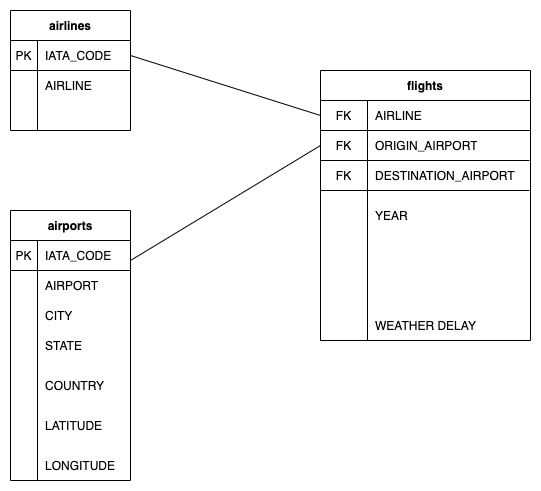

## DigitalSkola DE Final Project
Repository ini merupakan final project untuk kelas Data Engineering pada DigitalSkola untuk membuat Table(s) data warehouse. Sumber data yang digunakan merupakan subset dari data [flights-cancellation](https://www.kaggle.com/usdot/flight-delays?select=flights.csv).

### Skema Data
* [airlines.csv](datasets/airline.csv). Berisi data-data terkait maskapai
    * IATA_CODE (String): id/kode maskapai penerbangan
    * AIRLINE (String): nama maskapai penerbangan
* [airports.csv](datasets/airports.csv). Berisi data-data terkait bandara
    * IATA_CODE (String): id/kode bandara
    * AIRPORT (String): nama bandara
    * CITY (String): kota letak bandara
    * STATE (String): negara bagian bandara
    * COUNTRY (String): negara bandara
    * LATITUDE (Float): garis lintang bandara
    * LONGITUDE (Float): garis bujur bandara
* [flights.csv](datasets/flights.csv). Berisi data-data terkait penerbangan
    * YEAR (Integer): Tahun penerbangan
    * MONTH (Integer): Bulan penerbangan
    * DAY (Integer): Tanggal penerbangan
    * DAY_OF_WEEK (Integer): hari dalam seminggu dimulai dari minggu (0)
    * AIRLINE (String): id/kode maskapai penerbangan
    * FLIGHT_NUMBER (Integer): id/nomor penerbangan
    * TAIL_NUMBER (String): id/nomor registrasi unit pesawat
    * ORIGIN_AIRPORT (String): kode bandara asal
    * DESTINATION_AIRPORT (String): kode bandara tujuan
    * SCHEDULED_DEPARTURE (String): waktu rencana berangkat dalam format (HH:MM)
    * DEPARTURE_TIME (String): waktu kedatangan dalam format (HH:MM)
    * DEPARTURE_DELAY (Integer): keterlambatan keberangkatan dalam menit (negative value berarti pesawat berangkat lebih cepat dari jadwal)
    * WHEELS_OFF (String): waktu saat roda pesawat terangkat dalam format (HH:MM)
    * SCHEDULED_TIME (Integer): Durasi (menit) waktu yang diperkirakan dalam penerbangan
    * DISTANCE (Integer): Jarak (miles) antara bandara asal dan bandara tujuan
    * WHEELS_ON (String): waktu saat roda pesawat menyentuh landasan pada bandara tujuan dalam format (HH:MM)
    * SCHEDULED_ARRIVAL (String): waktu rencana kedatangan dalam format (HH:MM)
    * ARRIVAL_TIME (String): waktu kedatangan pesawat (tiba di bandara tujuan) dalam format (HH:MM)
    * DIVERTED (Integer): pesawat mendarat pada bandara yang tidak memiliki jadwal (0 false, 1 true)
    * CANCELLED (Integer): penerbangan dibatalkan (0 false, 1 true)
    * CANCELLATION_REASON (String): asalan pembatalan (A - maskapai/airfline, B - cuaca, C - sistem penerbangan nasional, D - keamanan)
    * AIR_SYSTEM_DELAY (Integer): durasi (menit) waktu keterlambatan yang disebabkan oleh sistem penerbangan nasional
    * SECURITY_DELAY (Integer): durasi (menit) waktu keterlambatan yang disebabkan oleh alasan kemanan
    * AIRLINE_DELAY (Integer): durasi (menit) waktu keterlambatan yang disebabkan oleh maskapai
    * LATE_AIRCRAFT_DELAY (Integer): durasi (menit) waktu keterlambatan yang disebabkan oleh pesawat
    * WEATHER_DELAY (Integer): durasi (menit) waktu keterlambatan yang disebabkan oleh cuaca

#### ERD

### Tugas
* Buatlah ETL dengan tujuan untuk membuat Table DataWarehouse (Fact & Dim) berdasarkan dataset keterlambatan penerbangan
* Adapun komponen yang dibuat meliputi:
    * **Airflow (Docker) & File Airflow DAG** untuk melakukan otomasi terhadap ETL script yang dibuat. Asumsi ETL script akan dijalankan sehari sekali (setiap hari).
    * **ETL script** untuk melakukan proses ETL pada data, boleh menggunakan spark, python, ataupun java (pilih salah satu).
    * **Hadoop (Docker)** untuk menaruh table DataWarehouse yang telah dibuat. Format data yang digunakan untuk menulis data bisa menggunakan format apa saja seperti, csv, parquet, json, dll.
    * **Github repository** untuk menaruh tugas yang telah dibuat, yang didalamnya ada penjelasan mengenai:
        * Schema dari table(s) data warehouse yang dibuat & penjelasan terkait data modelling yang digunakan.
        * Flow dari komponen yang dibuat, terkait sumber data/table yang dibaca, lokasi dari output (table data warehouse) yang dihasilkan (path hdfs)

### Ekspektasi Flow
